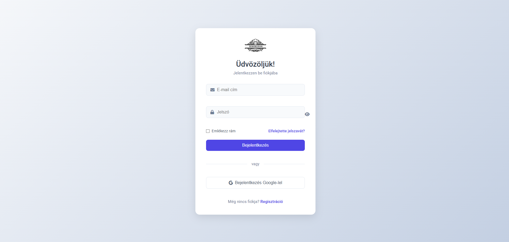

# Ízhorizon Éttermünk – Az ízek horizontján!
**Backend**

- Projektünkbe nagy lendülettel vágtunk bele, több ötletünk volt, hogy miről kellene csinálunk ezt a munkát.
Abban biztosak voltunk hogy weboldalt szeretnénk és abban is hogy valami olyan témát jelenitsünk meg ami mind a kettőnket érdekel vagy van valamilyen személyes élményünk is a dologgal. A figmas tervezés elég egyszerűen ment, egyértelműen tudtuk mit szeretnénk. Ahogy egyre jobban ástuk bele magunkat egyre több ötlet követte egymást, így született meg a mi tetszésünknek megfelelő terv. 
** 

- Próbáltunk egy friss, modern weblapot csinálni, benne hagyományos és előkelő stílussal. 

---

👉 [Figma terv megtekintése](https://www.figma.com/design/ipdP2BYytD8pvShEUWwQOF/Projekt?node-id=0-1&p=f&t=Wqw4hQMBFSGBfEpm-0)
